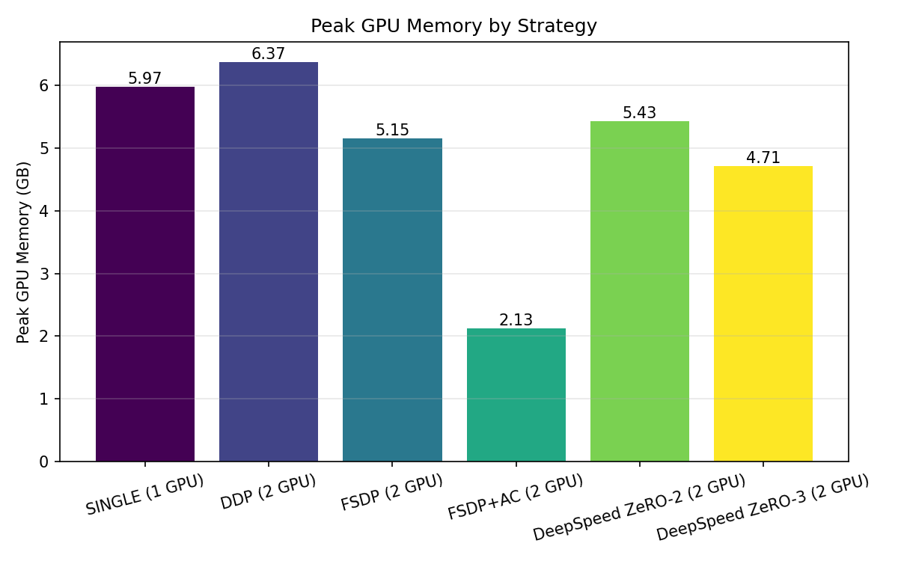
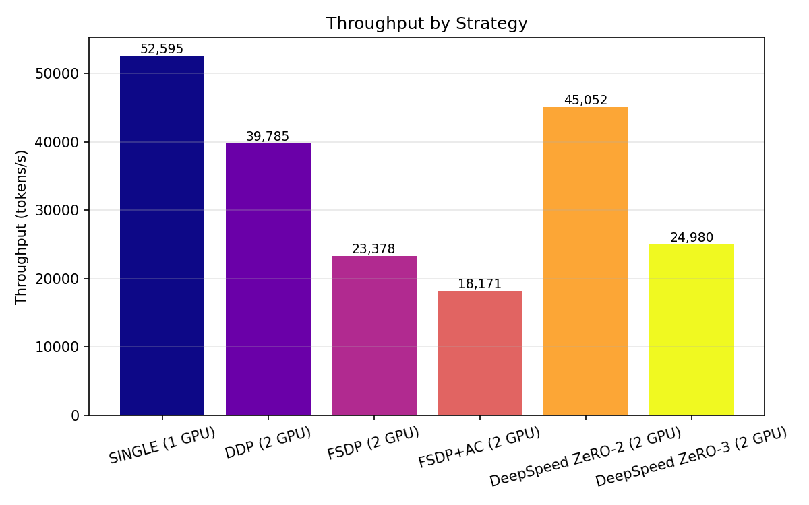
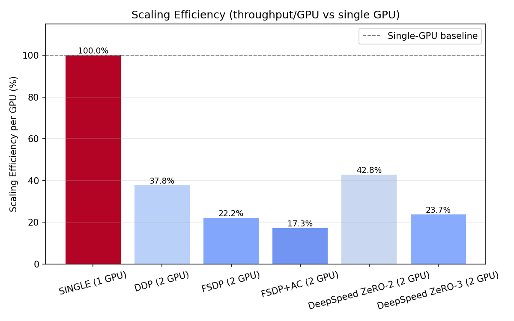

# Mini LLM Distributed Training

> A minimal reproducible lab for studying the **memory / throughput / communication trade-offs** of LLM distributed training.

用一个统一的小型 GPT workload，在 **Single GPU → DDP → FSDP → FSDP + activation checkpointing → DeepSpeed ZeRO-2 / ZeRO-3** 之间做公平对比，量化每种策略的**峰值显存、吞吐（tokens/s）、步耗时与扩展效率**，并用 **PyTorch Profiler** 解释背后的 NCCL 通信行为。

---

## Highlights

- ✅ 自研 **MiniGPT**（decoder-only transformer，可配置），作为统一 workload
- ✅ **Single GPU** 基线训练
- ✅ **DDP**（DistributedDataParallel，梯度 AllReduce）
- ✅ **FSDP**（FullySharded Data Parallel，参数/梯度/优化器状态分片）
- ✅ **FSDP + Activation Checkpointing**（以计算换显存）
- ✅ **DeepSpeed ZeRO-2 / ZeRO-3**（engine 接管训练步，分片优化器/梯度/参数）
- ✅ **BF16** 混合精度
- ✅ 统一 **Benchmark Harness**：自动测显存 / tokens/s / step time，写 CSV
- ✅ 自动生成 **memory / throughput / scaling efficiency** 图表
- ✅ **PyTorch Profiler**：分析 forward / backward / NCCL 通信占比
- ✅ 单元测试 + 集成测试（CPU 可跑）

---

## Architecture

同一个 MiniGPT workload 在多种策略下运行，共用统一 Trainer 与 Benchmark Harness：

```
同一个 MiniGPT workload
        │
        ├── single     ──► 全量模型，单卡基线
        ├── ddp        ──► 每卡全量副本 + 梯度 AllReduce
        ├── fsdp       ──► 参数/梯度/优化器分片 + AllGather / ReduceScatter
        │                  └── (+ activation checkpointing)
        └── deepspeed  ──► ZeRO-2：分片优化器+梯度
                           ZeRO-3：参数/梯度/优化器全分片（engine 接管 step）
        │
        ▼
统一 Benchmark Harness ──► CSV ──► 图表
统一 Trainer ──► PyTorch Profiler ──► 通信分析
```

```
mini-llm-distributed-training/
├── README.md
├── pyproject.toml / requirements.txt
├── configs/            # gpt_small.yaml / deepspeed_z2.json / deepspeed_z3.json
├── src/mini_llm/
│   ├── model.py        # MiniGPT
│   ├── data.py         # synthetic dataset
│   ├── trainer.py      # 统一 trainer（single/ddp/fsdp/deepspeed）
│   ├── train.py        # 训练入口
│   ├── utils.py
│   └── distributed/
│       ├── ddp.py
│       ├── fsdp.py
│       └── deepspeed.py
├── scripts/            # train_single/ddp/fsdp/deepspeed.sh, benchmark.sh
├── benchmarks/         # benchmark.py, plot.py, results/
├── profiling/          # pytorch_profiler.py, traces/
├── tests/
└── docs/               # ddp.md, fsdp.md, deepspeed.md
```

---

## Environment

### Hardware

| 项 | 值 |
| --- | --- |
| GPU | 2 × NVIDIA GeForce RTX 4090 (24 GB) |
| CPU | 32 核 |
| RAM | 1.0 TiB |
| OS | Ubuntu 22.04.3 LTS (kernel 5.15) |

### Software

| 项 | 值 |
| --- | --- |
| Driver | 595.71.05 |
| CUDA (driver) | 13.2 |
| CUDA (PyTorch build) | 12.1 |
| cuDNN | 8.9.2 |
| NCCL | 2.20.5 |
| PyTorch | 2.3.0+cu121 |
| Python | 3.12.3 |
| DeepSpeed | 0.14.4（0.19.6 因 Dynamo 不支持 Python 3.12 而不可用） |
| Triton | 未安装（本项目不使用 torch.compile，非必需） |

> 本项目使用 **synthetic random tokens** 作为数据，因此结果**确定、可复现、不受磁盘/分词器影响**，聚焦纯系统性能。

---

## Quick Start

### 1. 安装

```bash
pip install -r requirements.txt
# 或可编辑安装（推荐，便于 import mini_llm）
pip install -e .
```

### 2. 快速验证（单卡训练，loss 应下降）

```bash
bash scripts/train_single.sh 8 3
```

### 3. 一键跑完整 benchmark 矩阵并出图

```bash
bash scripts/benchmark.sh
```

该脚本依次运行 `single → ddp → fsdp → fsdp+ac → deepspeed_z2 → deepspeed_z3`，
把结果追加到 `benchmarks/results/benchmark.csv`，并生成三张图。

### 4. 单独跑某一种策略

```bash
# 单卡
python benchmarks/benchmark.py --strategy single --config configs/gpt_small.yaml

# DDP 2 卡
torchrun --nproc_per_node=2 benchmarks/benchmark.py \
    --strategy ddp --config configs/gpt_small.yaml

# FSDP 2 卡
torchrun --nproc_per_node=2 benchmarks/benchmark.py \
    --strategy fsdp --config configs/gpt_small.yaml

# FSDP + activation checkpointing
torchrun --nproc_per_node=2 benchmarks/benchmark.py \
    --strategy fsdp --config configs/gpt_small.yaml --use-activation-checkpointing

# DeepSpeed ZeRO-2（需指定 --ds-config）
torchrun --nproc_per_node=2 benchmarks/benchmark.py \
    --strategy deepspeed --config configs/gpt_small.yaml \
    --ds-config configs/deepspeed_z2.json

# DeepSpeed ZeRO-3
torchrun --nproc_per_node=2 benchmarks/benchmark.py \
    --strategy deepspeed --config configs/gpt_small.yaml \
    --ds-config configs/deepspeed_z3.json
```

### 5. 跑测试

```bash
pytest -v
```

---

## Benchmark

### Workload & Metrics

统一 workload 为 ~110M 参数的 MiniGPT（`configs/gpt_small.yaml`）。所有策略使用**相同**模型、数据与训练步，保证公平对比。

| 记录项 | 值 |
| --- | --- |
| GPU | 2 × NVIDIA RTX 4090 (24 GB) |
| CUDA | 12.1 |
| PyTorch | 2.3.0+cu121 |
| dtype | bf16（autocast / FSDP MixedPrecision / DeepSpeed bf16） |
| shape | hidden=768, layers=12, heads=12, seq_len=512 |
| batch | micro_batch=8 |
| warmup iterations | 5 |
| benchmark iterations | 20 |
| 模型参数 | 109,923,072 (~110M) |

**指标**：峰值显存 (GB/GPU)、吞吐 (tokens/s)、步耗时 (ms/step)、扩展效率 (per-GPU 吞吐相对单卡)。

### Results

| Strategy | GPUs | Peak Memory/GPU (GB) | tokens/s | step_ms | Scaling Efficiency |
| --- | ---: | ---: | ---: | ---: | ---: |
| Single | 1 | 5.97 | 52,595 | 77.9 | 100% |
| DDP | 2 | 6.37 | 39,785 | 103.0 | 37.8% |
| FSDP | 2 | 5.15 | 23,378 | 175.2 | 22.2% |
| FSDP + AC | 2 | 2.13 | 18,171 | 225.4 | 17.3% |
| DeepSpeed ZeRO-2 | 2 | 5.43 | 45,052 | 90.9 | 42.8% |
| DeepSpeed ZeRO-3 | 2 | 4.71 | 24,980 | 164.0 | 23.7% |

### Plots

生成的图表（`benchmarks/results/`）：

- `memory.png` — 各策略峰值显存
- `throughput.png` — 各策略 tokens/s
- `scaling_efficiency.png` — 每 GPU 吞吐相对单卡的扩展效率





---

## Analysis

> 基于 2 × RTX 4090 实测数据（BF16，micro_batch=8，~110M 参数）。**注意**：本模型很小（单卡仅 ~6GB 显存），多卡收益被通信/启动开销主导，因此扩展效率偏低——这正是小模型 + 多卡场景的典型现象。

1. **显存-吞吐权衡清晰，没有免费午餐**：从 Single → DDP → FSDP → FSDP+AC → DeepSpeed ZeRO-3，峰值显存总体下降（5.97 → 6.37 → 5.15 → 2.13 → 4.71 GB），吞吐也随之变化（52,595 → 39,785 → 23,378 → 18,171 → 24,980 tokens/s）。**省显存通常以吞吐为代价。**

2. **DDP 显存 ≈ 单卡（6.37 vs 5.97 GB），但吞吐反而下降**：DDP 每卡持完整副本，显存几乎不随卡数下降。本模型太小，单卡计算量不足以掩盖 AllReduce 通信与 kernel 启动开销，2 卡扩展效率仅 37.8%。

3. **FSDP 显存下降 ~19%（5.15 GB），通信开销更大**：参数/梯度/优化器分片省显存，但每层 forward/backward 都要 **AllGather + ReduceScatter**。Profiler 实测 FSDP 通信时间（640.9 ms）是 DDP（245.9 ms）的 **2.6 倍**，通信占比 18.7% vs 15.3%，故吞吐进一步降至 23,378 tokens/s（扩展效率 22.2%）。

4. **FSDP + AC 显存再降 ~59%（2.13 GB），以计算换显存**：activation checkpointing 丢弃中间激活、反向时重算，吞吐降至 18,171 tokens/s（扩展效率 17.3%）。这是显存-吞吐权衡的极端端。

5. **DeepSpeed ZeRO-2 是 2 卡分片策略中吞吐最高的（45,052 tokens/s，扩展效率 42.8%）**：ZeRO-2 只分片优化器状态与梯度，**参数仍是每卡全量副本**，因此 forward 无需 AllGather 参数，通信主要是反向时的 ReduceScatter，比 FSDP 的逐层 AllGather+ReduceScatter 更轻。显存 5.43 GB 略高于 FSDP（5.15 GB），但吞吐接近 DDP 且明显高于 FSDP。

6. **DeepSpeed ZeRO-3 进一步分片参数，显存最低（4.71 GB）但吞吐骤降**：ZeRO-3 连模型参数也分片，每次 forward/backward 都要 **AllGather 参数 + ReduceScatter 梯度**，通信量最大，吞吐降至 24,980 tokens/s（扩展效率 23.7%），与 FSDP 相当。ZeRO-3 的价值在于**能装下单卡完全放不下的超大模型**，而非提升小模型吞吐。

7. **扩展效率均 < 100%，小模型不适合盲目上多卡**：多卡存在通信开销、负载不均与 kernel 启动开销。FSDP/ZeRO 分片策略的真正价值在于**能训练单卡放不下的更大模型**，而非提升小模型吞吐。若要观察 DDP 近似线性扩展或分片策略相对优势，需增大模型/批次使计算量足以掩盖通信。

---

## Profiling

用 PyTorch Profiler 分析单个训练步的算子与 NCCL 通信耗时：

```bash
# DDP 2 卡
torchrun --nproc_per_node=2 profiling/pytorch_profiler.py \
    --strategy ddp --config configs/gpt_small.yaml

# FSDP 2 卡
torchrun --nproc_per_node=2 profiling/pytorch_profiler.py \
    --strategy fsdp --config configs/gpt_small.yaml
```

输出：
- Chrome trace JSON（`profiling/traces/*.json`），可用 `chrome://tracing` 或 Perfetto 打开
- 终端打印 Top 算子表 + **通信时间占比**

### 实测通信占比（2 × RTX 4090, bf16, micro_batch=8）

| Strategy | 主要通信算子 | 通信时间 (ms) | 总 CUDA 时间 (ms) | 通信占比 |
| --- | --- | ---: | ---: | ---: |
| DDP | AllReduce (梯度) | 245.9 | 1,606.0 | **15.3%** |
| FSDP | AllGather (147.4 ms) + ReduceScatter (58.0 ms) + AllReduce (6.3 ms) | 640.9 | 3,421.8 | **18.7%** |

> FSDP 的通信时间约为 DDP 的 **2.6 倍**，且 AllGather 调用次数（202 次）远多于 DDP 的 AllReduce（26 次）——这正是 FSDP 吞吐显著低于 DDP 的直接原因。

### 通信模式

**DDP 梯度同步（AllReduce）**：

```
Forward ──► Backward ──► 梯度桶就绪 ──► NCCL AllReduce ──► Optimizer step
```

**FSDP 前向（AllGather）**：

```
参数分片 ──► AllGather ──► 完整参数 ──► 计算 ──► 释放完整参数
```

**FSDP 反向（ReduceScatter）**：

```
梯度 ──► ReduceScatter ──► 梯度分片（每卡只留自己的分片）
```

---

## Documentation

- [docs/ddp.md](docs/ddp.md) — DDP 原理、梯度 AllReduce、为什么多卡不一定线性加速
- [docs/fsdp.md](docs/fsdp.md) — FSDP 分片、AllGather / ReduceScatter、与 activation checkpointing 的关系
- [docs/deepspeed.md](docs/deepspeed.md) — DeepSpeed engine、ZeRO-2 vs ZeRO-3 分片差异与实测对比
- [docs/setup-and-debug-log.md](docs/setup-and-debug-log.md) — 完整操作过程与排错记录（环境搭建、pytest 段错误、YAML 科学计数法、FSDP API、DeepSpeed 版本兼容等报错及修复方法）

---

## Roadmap

- [x] v0.1：Single / DDP / FSDP / FSDP+AC + benchmark + profiling
- [x] v0.2：DeepSpeed ZeRO-2 / ZeRO-3 对比
- [ ] v0.3：Megatron TP / PP / SP 实验
- [ ] v0.4：分布式 checkpoint / resume training

---

## License

MIT
